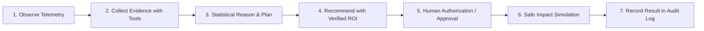

# AI Cloud Cost Optimizer — Autonomous Agentic FinOps Platform

[](https://www.python.org/)
[](https://fastapi.tiangolo.com/)
[](https://reactjs.org/)
[](https://vitejs.dev/)
[](https://tailwindcss.com/)
[]()

> **Production-quality, runnable full-stack web application for Multi-Cloud Cost Optimization with an Autonomous Agentic AI Layer.**

---

## 🌟 Core Differentiator: The Agentic AI Layer

Unlike static dashboards or basic prompt chatbots, the **AI Cloud Cost Optimizer** implements a deterministic 7-step autonomous workflow lifecycle:



### Backend Deterministic Tool Calling Chain
1. `get_cost_records()`: Queries raw multi-cloud expenditure records and distributions.
2. `get_service_costs()`: Aggregates spend by cloud services across AWS, Azure, and GCP.
3. `calculate_cost_growth()`: Computes 30-day velocity, acceleration rate, and period-over-period delta.
4. `get_anomalies()`: Identifies statistical positive cost spikes via rolling Z-scores and IQR outlier analysis.
5. `get_resource_usage()`: Analyzes real-time CPU/Memory utilization across all compute fleets.
6. `find_idle_resources()`: Flags 0% activity, stopped, or unattached wasteful infrastructure.
7. `find_underutilized_resources()`: Identifies sustained low-load instances (< 25% CPU) eligible for rightsizing.
8. `forecast_cost()`: Computes Holt's linear exponential smoothing projections with 95% confidence intervals.
9. `estimate_savings()`: Calculates mathematical savings across Rightsizing, Idle Cleanup, Storage Tiering, and Savings Plans.
10. `generate_optimization_plan()`: Synthesizes structured recommendations with priority badges and risk levels.

---

## 🎨 Design System & Theme Requirement

- **STRICT LIGHT THEME ONLY**: High-contrast, clean enterprise SaaS palette.
- **Primary Colors**: White (`#FFFFFF`), Slate (`#F8FAFC`, `#F1F5F9`), Slate Borders (`#E2E8F0`), Deep Navy Text (`#0F172A`, `#334155`), and Indigo/Brand Accent (`#4F46E5`, `#2563EB`).
- **No Dark Mode**: Fully compliant with enterprise light theme standards.

---

## 🚀 Quickstart Guide

### Prerequisites
- Python 3.10+
- Node.js 18+ and npm

### 1. Automated Virtual Environment & Database Setup
```bash
# In project root:
cd backend
python -m venv ..\venv
..\venv\Scripts\pip install -r requirements.txt

# Verify database creation & seed demo data
..\venv\Scripts\python test_init.py
```

### 2. Start the Backend API Server
```bash
cd backend
..\venv\Scripts\uvicorn app.main:app --host 0.0.0.0 --port 8000 --reload
```
- **API Documentation**: [http://localhost:8000/docs](http://localhost:8000/docs)
- **Health Check**: [http://localhost:8000/api/health](http://localhost:8000/api/health)

### 3. Start the React Frontend
```bash
cd frontend
npm install
npm run dev
```
- **Web Application**: [http://localhost:5173](http://localhost:5173)

---

## 🔑 Demo Workspace Credentials

| Role | Email | Password |
| :--- | :--- | :--- |
| **Admin** | `demo@cloudoptimizer.ai` | `OptimizerDemo2026!` |

---

## 🧪 Automated Test Suite

Run the full pytest suite covering authentication, ML statistical algorithms, agent tools, and API routes:

```bash
cd backend
..\venv\Scripts\pytest -v
```

**Test Results: 15 Passed (100% Pass Rate)**
- `test_password_hashing`, `test_jwt_token_generation_and_decoding`, `test_refresh_token_generation`
- `test_anomaly_detection_rolling_z_score`, `test_time_series_forecasting`, `test_savings_engine_calculations`
- `test_agent_cost_and_resource_tools`
- `test_health_check_endpoint`, `test_cost_summary_endpoint`, `test_agent_run_pipeline`
- `test_recommendation_approval_and_simulation`, `test_ai_copilot_endpoint`, `test_report_generation`
- `test_alerts_webhook_test_trigger`, `test_admin_system_health`

---

## 📁 Architecture Overview

```
├── backend/
│   ├── app/
│   │   ├── agents/          # Agentic AI Controller, Planner, Decision Engine, Memory
│   │   ├── ml/              # Rolling Z-Score Anomaly Detector, Holt's Forecaster, Savings Engine
│   │   ├── models/          # 20+ SQLAlchemy Relational ORM Models
│   │   ├── routers/         # 19 Modular FastAPI Endpoints
│   │   ├── schemas/         # Pydantic v2 Request/Response Schemas
│   │   ├── security/        # Native Bcrypt Hashing, JWT HS256 Token Rotation, RBAC
│   │   ├── services/        # Google Gemini LLM Provider with FinOps Heuristic Fallback, PDF/CSV Reports
│   │   ├── tools/           # 10 Deterministic Agent Backend Telemetry Tools
│   │   └── utils/           # Realistic 90-Day Multi-Cloud Seeder (AWS, Azure, GCP)
│   └── tests/               # Pytest Automated Test Suite
│
├── frontend/
│   ├── src/
│   │   ├── components/      # Light-themed SaaS Design System, Recharts, KPI Cards, Modals
│   │   ├── contexts/        # Auth, Toast Notifications, Multi-Currency Switcher (USD, EUR, INR)
│   │   ├── layouts/         # MainLayout (with Workspace & Currency Bar), AuthLayout
│   │   ├── pages/           # 20 Enterprise Feature Pages
│   │   └── services/        # Axios API Client with JWT Interceptors and Auto Refresh
│   └── tailwind.config.js   # Light-theme Custom Tokens
```
